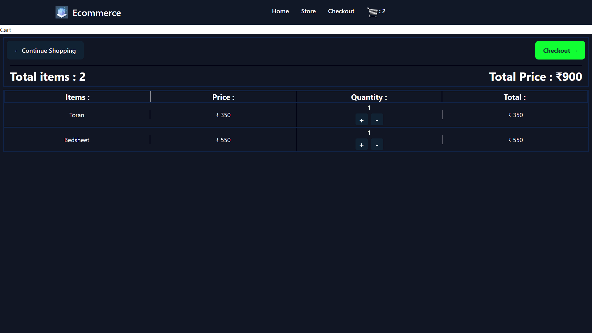
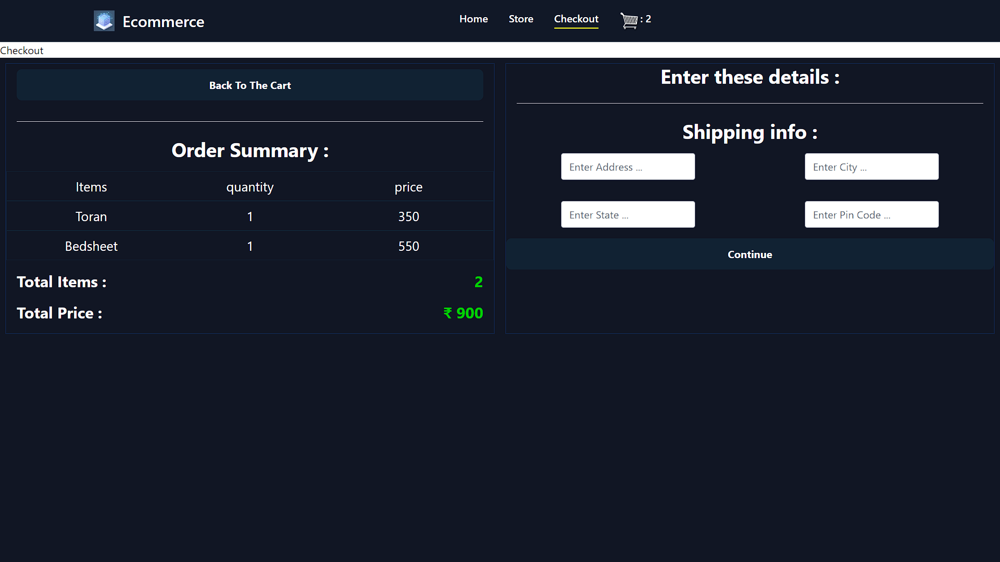

# Ecommerce website

This is a fully functional e-commerce website made using Django for backend and it's native tempelating engine (HTML ,CSS and JS) for frontend 

The e-commerse website has all the store functionality , add to cart , apppend and remove products from the cart , global billing , checkout and shipping info collection 

This website is fully responsive fromsmalll to large displays

Store :

Cart :

Checkout :

